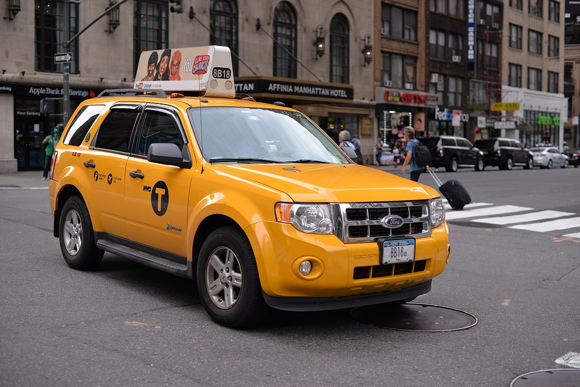

# Practica01-MiBlog

PROGRAMACION HTML

HTML5 (HyperText Markup Language, versión 5) es la quinta revisión importante del lenguaje básico de la World Wide Web, HTML. HTML5 especifica dos variantes de sintaxis para HTML: una «clásica», HTML (text/html), conocida como HTML5, y 
una variante XHTML conocida como sintaxis XHTML5 que deberá servirse con sintaxis XML (application/xhtml+xml).Esta es la primera vez que HTML y XHTML se han desarrollado en paralelo. La versión definitiva de la quinta revisión del estándar se publicó en octubre de 2014.
Al no ser reconocido en viejas versiones de navegadores por sus nuevas etiquetas, se recomienda al usuario común actualizar su navegador a la versión más nueva, para poder disfrutar de todo el potencial que provee HTML5.
El desarrollo de este lenguaje de marcado es regulado por el Consorcio W3C.

PAGINA PRINCIPAL 
<!DOCTYPE html>
<html lang="es">
 <head>
    <meta charset="UTF-8">
    <title> Radio Taxy Transporte Confiable</title>
 </head>

<body>
    <header>
            <h1>Radio Taxy</h1>
    </header>
    <header>
         
    </header>
    <nav>
            <ul>
                    <li><a href="index.html"><strong> Principal</strong></a></li>
                    <li><a href="Contactos.html"><strong> Contactos</strong></a></li>
                    <li><a href="Despacho.html"><strong> Despacho</strong></a></li>
                    <li><a href="locaciones.html"><strong> Locaciones</strong></a></li>
                    <li><a href="Tipos.html"><strong>Tipos Transporte</strong></a></li>
                    
                </ul>
    </nav>
    <section>
            <article>
                    <h1>Pagina Principal</h1>

                   
<strong>Taxi</strong> es un medio de transporte público ofrecido por los ayuntamientos con tarifas reguladas que consiste en un 
                    vehículo de transporte con conductor con una autorización de transporte (VT) y una licencia del ayuntamiento, que 
                    ofrece servicios de transporte de una persona o un grupo pequeño de pasajeros dirigidos a igual o diferentes destinos por contrato o dinero. Usualmente, los lugares donde se recoge y se deja al pasajero se deciden por el proveedor 
                    (oferente), mientras que en el caso del taxi, el usuario (demandante) los determina. 
                   <em> Es decir, a diferencia de los otros tipos de transporte de personas, como son las líneas del metro,tranvía o del 
                    autobús, el servicio ofrecido por el taxi se caracteriza por ser puerta a puerta.</em>

                    <aside>
                    
 En la edad media ya existía el arrendamiento de mulas y también los transportistas eran un gremio especializado en la época.​En el siglo XVII, en Londres y
                     París existían empresarios especializados en la cría de caballos y mulas para el alquiler.

                    
                    </aside>
                     
                    

                    <table border="1">
                            <caption><samp>TARIFAS DE TRANSPORTE</samp></caption>
                            <tr>
                                
                                        <td rowspan="2"><strong>Datos</strong></td>
                                        <td colspan="2">Fijo de salida</td>
                            <tr>
                                    <td><strong>Importe de distancia</strong></td>
                                    <td><strong>Importe por tiempo detenido</strong></td>
                            </tr>
                            
                            <tr>
                                <td><strong>Importe de recargos</strong></td>
                                <td>Por dia</td>
                                <td>Por hora</td>
                            </tr>
                            <tr>
                                <td><strong>Importe de recargos</strong></td>
                                <td>Viajes Nacionales</td>
                                <td>Viajes Internacionales</td>
                            </tr>
                            <tr>
                                <td
                                    colspan="3"> Radio Taxy Transporte Confiable
                                </td>
                            </tr>

                         </table>
                        

                         <iframe width="560" height="315" src="https://www.youtube.com/embed/Ewn8jjrrHQU" frameborder="0" 
                         allow="accelerometer; autoplay; encrypted-media; gyroscope; picture-in-picture" allowfullscreen></iframe>
            
            <ul>
                    <li><small>Con la eficiencia</small></li>
                    <li><small>Con la calidad</small></li>
                    <li><small>Efectividad</small></li>
                    <li><small>Inovaccion</small></li>
                    <li><small>Eficacia</small></li>
            </ul>
            
             </article>

            <article>
                     En la mayoría de lugares turísticos también existen bici-taxis y moto-taxis, especialmente en playas y balnearios. Sus precios son cómodos y realizan recorridos cortos dentro de las ciudades costeras.
                    Movilizarse dentro del Ecuador y sus ciudades es sencillo, sin embargo usted debe tener 
                    en cuenta estos consejos básicos para transportarse de manera fácil y segura.
                    
            </article>
            <article>
                 
                    Otra opción que usted posee es el alquiler de coches. Si va a manejar dentro del país es importante que usted sepa que en Ecuador se conduce por la derecha. Además de la carretera Panamericana que cruza el país desde la frontera colombiana
                     hasta la frontera peruana, hay una amplia red de vías que recorren el Ecuador.
                
             </article>

    </section>
    <section>
        <article>
        <h2>GENERALIDADES</h2>
         
        <aside> En el caso de transporte urbano, un taxi es un medio de transporte que permite desplazamientos rápidos, confortables y directos principalmente en áreas urbanas. El usuario paga una tarifa al conductor, (tarifa que estipula el ayuntamiento, nunca el taxista), a cambio del servicio de transporte prestado. Provee un servicio flexible y conveniente, por lo que es uno de los sistemas de transporte no subvencionado. A diferencia de los sistemas de transporte colectivo, como metro, BRT, tranvía o bus, en los que existen unos principios generales para su diseño, regulación y operación, los sistemas de taxis son mucho más complejos
             y tienen muchas más variables a ser consideradas y muchos más actores.</aside>
        </article>
        <article>
             
            Una de las formas más comodas y seguras de trasladarse en Ecuador es el taxi, en el caso de las grandes ciudades se recomienda usar sólo taxis amarillos que poseen su credencial a la vista.
            En pequeño pueblos y lugares más apartados de las ciudades, el medio de transporte que reemplaza al taxi es la camioneta, éstas no poseen taximetro y se recomienda pactar el costo de la carrera antes de subirse al auto.  
            Se recomienda que consiga una Guía Vial de Ecuador la cual 
            puede conseguirla en cualquier librería, tienda turística o en el aeropuerto.
        </article>
        

        <article>
                 Es preferible que adquiera un mapa vial antes de iniciar su viaje y debe tener en cuenta que durante el camino encontrará varios peajes, puntos de pago obligatorio para el mantenimiento de vías, en donde cancela de uno a dos dólares. En época de 
               lluvias es preferible alquilar carros altos ya que las vías pavimentadas se deterioran y se forman los socavones que comúnmente se los conocen aquí con el nombre de baches.
        </article>
    </section>

<footer> 
   <small><strong>&#8226;Jonnathan Enrique Ochoa Calderon 
     &#8226;Universidad Politecnica Salesiana
     &#8226;Correo: <a href="mailto:jochoac6@est.ups.edu.ec">jochoac6@est.ups.edu.ec</a> 
     &#8226;Telefono:<a href="tel:4132350">4132350</a> &#8226;Todos los derechos reservados &#169;
   </strong>
</small>

</footer>
    
</body>
</html>

PAGINA CONTACTO

<!DOCTYPE html>
<html lang="es">
 <head>
    <meta charset="UTF-8">
    <title> Contacto</title>
 </head>
 <body>
     <header>
         
     </header>
    <header>
     <nav>
            <ul>
                    <li><a href="index.html"><strong> Principal</strong></a></li>
                    <li><a href="Contactos.html"><strong> Contactos</strong></a></li>
                    <li><a href="Despacho.html"><strong> Despacho</strong></a></li>
                    <li><a href="locaciones.html"><strong> Locaciones</strong></a></li>
                    <li><a href="Tipos.html"><strong>Tipos Transporte</strong></a></li>
                    
                </ul>
    </nav>
     
         <article>
             <h1>Contactos</h1>
             
              <section>
                     
                      <dl id="Contactos">
                          
                            <dt>TELEFONOS:</dt>
                            <dd>289-89-45</dd>
                            <dd>41-32-350</dd>
                            
                       
                            <dt>CELULARES:</dt>
                            <dd>0989420495</dd>
                            <dd>0968774185</dd>
                            
                     
                            <dt>CORREO ELECTRONICO</dt>
                            <dd>enriqueochoa87@gmail.com</dd>
                            <dd>jocohoac6@est.ups.edu.ec</dd>
                            
                            
                            <dt>REDES SOCIALES</dt>
                            <dd>Facebook:TaxyDriver</dd> 
                        
                    
    
                        
                        </dl>
                    
                    
                    
                     

              </section>
                 
                    
                    

             

         </article>
    </header>

     <footer>
          
        <small><strong>&#8226;Jonnathan Enrique Ochoa Calderon 
          &#8226;Universidad Politecnica Salesiana
          &#8226;Correo: <a href="mailto:jochoac6@est.ups.edu.ec">jochoac6@est.ups.edu.ec</a>
          &#8226;Telefono:<a href="tel:4132350">4132350</a> &#8226;Todos los derechos reservados &#169;
        </strong>
     </small>
     </footer>
 </body>
</html>

PAGINA DESPACHO 

<!DOCTYPE html>
<html lang="es">
 <head>
    <meta charset="UTF-8">
    <title> Despachos</title>
 </head>
 <body>
     <header>
         
     </header>
     <header>
     <nav>
            <ul>
                    <li><a href="index.html"><strong> Principal</strong></a></li>
                    <li><a href="Contactos.html"><strong> Contactos</strong></a></li>
                    <li><a href="Despacho.html"><strong> Despacho</strong></a></li>
                    <li><a href="locaciones.html"><strong> Locaciones</strong></a></li>
                    <li><a href="Tipos.html"><strong>Tipos Transporte</strong></a></li>
                    
                </ul>
    </nav>
     
         <article>
             <h1>Despachos</h1>
             
             <dl id="Despachos">
                    <dt>
                            La demanda es servida por la combinación de servicios prestados a través de los 
                            tres segmentos: despacho, calle y contrato.Sin embargo, los segmentos por despacho 
                            y en la calle son los predominantes.
                    </dt>
                    <dd>
                             <strong>Por el segmento de despacho:</strong>solicitado por teléfono o aplicación móvil, a 
                            una central, presta el servicio puerta a puerta, en zonas donde conseguir 
                            un taxi en la calle es difícil,
                            durante la noche, por la baja demanda, o por seguridad. Al segmento de despacho se puede acceder bien sea llamando a una central donde, por medio de un sistema de radio de dos vías, se busca el taxi, o por otros medios como puede ser teléfonos celulares o Internet.
                            
                             <strong>Por el segmento de la calle:</strong>
                             las personas salen a la vía en búsqueda del servicio.
                            Este segmento se divide a su vez en dos grandes ramas: Taxis de la calle o taxis de 
                            zonas de espera.
                             <strong>Por el segmento de contrato:</strong>
                             el usuario contacta directamente al conductor del taxi, 
                            cada vez que quiera que le sea prestado el servicio y se le paga generalmente por 
                            horas o por actividad a un precio diferente al de la tarifa.
                        </dd>

                    

             </dl>

         </article>
         <article>
             <h1>Tarifas</h1>
             
             

                    La tarifa es el valor monetario que se paga en contraprestación del servicio prestado. La tarifa siempre es regulada. O por zonas y precios fijos y cuando no es así, el vehículo debe estar provisto con un dispositivo de medición (taxímetro) para determinar el valor a pagar según la distancia
                     recorrida. La tarifa puede considerar diferentes parámetros para su cálculo:
             

             <ul>
                    <li><small>Importe Fijo</small></li>
                    <li><small>Importe por tiempo detenido</small></li>
                    <li><small>Importes y recargos segun el dia</small></li>
                    <li><small>Importes por viajes</small></li>
                    <li><small>Importes por solicitud de servicios</small></li>
            </ul>

         </article>
     </header>

     <footer> 
        <small><strong>&#8226;Jonnathan Enrique Ochoa Calderon 
          &#8226;Universidad Politecnica Salesiana
          &#8226;Correo: <a href="mailto:jochoac6@est.ups.edu.ec">jochoac6@est.ups.edu.ec</a>
          &#8226;Telefono:<a href="tel:4132350">4132350</a> &#8226;Todos los derechos reservados &#169;
        </strong>
     </small>
     </footer> 

 </body>
</html>

PAGINA DE LOCACIONES

<!DOCTYPE html>
<html lang="es">
 <head>
    <meta charset="UTF-8">
    <title> Locaciones</title>
 </head>
 <body>
     <header>
            
     </header>
     <nav>
            <ul>
                    <li><a href="index.html"><strong> Principal</strong></a></li>
                    <li><a href="Contactos.html"><strong> Contactos</strong></a></li>
                    <li><a href="Despacho.html"><strong> Despacho</strong></a></li>
                    <li><a href="locaciones.html"><strong> Locaciones</strong></a></li>
                    <li><a href="Tipos.html"><strong>Tipos Transporte</strong></a></li>
                    
                </ul>
    </nav>
     <article>
            <h1>Locaciones</h1>
            
            <dl id="Locaciones">
                    
                    <dt>     7 a.m. -  11 p.m.    </dt>
                    <dd>CUENCA-AZUAY</dd>
                    
                    
                    <dt>     9 p.m. - 10 p.m.</dt>
                    <dd>CHORDELEG-AZUAY</dd>
                
                    
                    <dt>     6 p.m. - 8 p.m.</dt>
                    <dd>PAUTE-AZUAY</dd>
                    
                 
                </dl>
           
         </article>
         <footer>
             <b>&#8226; PROVINCIA DEL AZUAY TELF: (41-32-350)</b>
          </footer>
     
 </body>
</html>

PAGINA DE TIPO

<!DOCTYPE html>
<html lang="es">
 <head>
    <meta charset="UTF-8">
    <title> Tipos de Vehiculos</title>
 </head>
 <body>
     <header>
         
     </header>
     <header>
     <nav>
            <ul>
                    <li><a href="index.html"><strong> Principal</strong></a></li>
                    <li><a href="Contactos.html"><strong> Contactos</strong></a></li>
                    <li><a href="Despacho.html"><strong> Despacho</strong></a></li>
                    <li><a href="locaciones.html"><strong> Locaciones</strong></a></li>
                    <li><a href="Tipos.html"><strong>Tipos Transporte</strong></a></li>
                    
                </ul>
    </nav>
     
         <article>
             <h1>Vehiculos</h1>
             
             <dl id="Vehiculos">
                    
                    <dt>TAXY EJECUTIVO</dt>
                    <dd> </dd>
                    
                    
                    
                    
                    <dt>TAXY COMPOSTELA:</dt>
                    <dd> </dd>
                    
                   
                   
                   
                    <dt>TAXY NORMAL</dt>
                    <dd></dd>
                   
                    
                    
                   
                    <dt>TAXY CARGA</dt>
                    <dd> </dd>
                    
                    
                    

                    

             </dl>

         </article>
     </header>

    <footer> 
   <small><strong>&#8226;Jonnathan Enrique Ochoa Calderon 
     &#8226;Universidad Politecnica Salesiana
     &#8226;Correo: <a href="mailto:jochoac6@est.ups.edu.ec">jochoac6@est.ups.edu.ec</a> 
     &#8226;Telefono:<a href="tel:4132350">4132350</a> &#8226;Todos los derechos reservados &#169;
   </strong>
</small>
</footer>
 </body>
</html>
